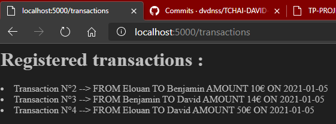
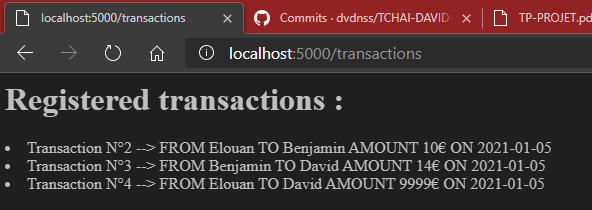
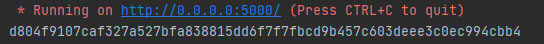
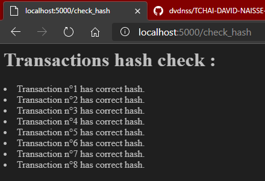
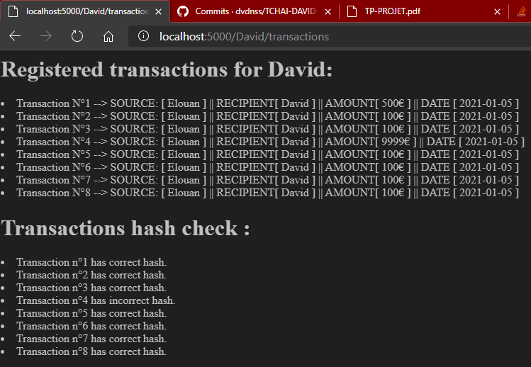
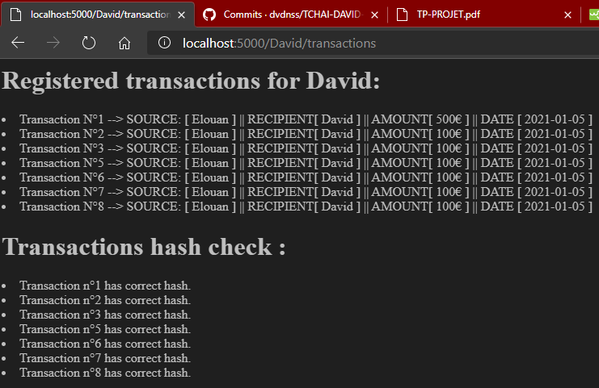
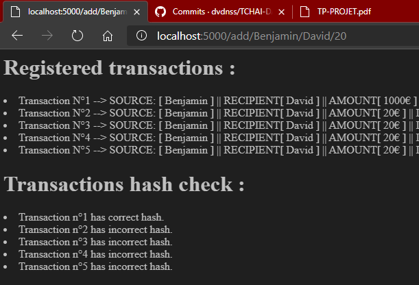
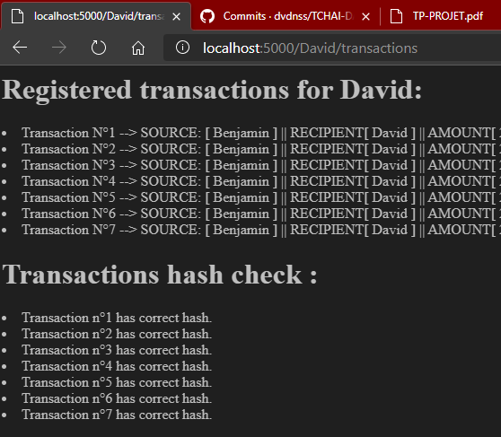
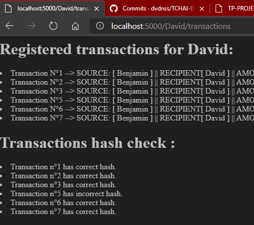
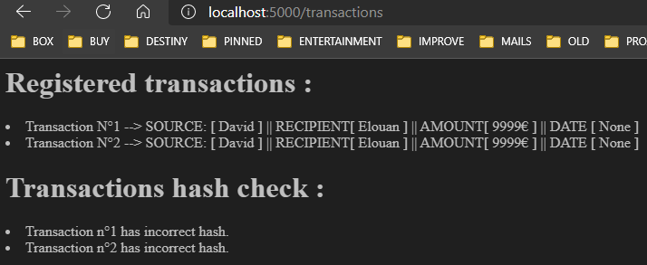

# Projet TP : Systèmes d'information avancés

### Objectif :

Concevoir un système de transactions électroniques avec une intégrité garantie, accessible par le protocole HTTP.

### Auteurs :

* David NAISSE (david_naisse@etu.u-bourgogne.fr)
* Benjamin SCORDEL (benjamin_scordel@etu.u-bourgogne.fr)

### Choix des outils :

* __Langage__ ----- Python : forte préférence car c'est le langage que nous utilisons le plus.
* __GitHub__ ------- Github Desktop : beaucoup plus accessible et intuitif, l'affichage graphique en fait un outil
  simple et efficace.
* __Framework__ -- Flask : seul Framework à notre connaissance pour faire ce projet.
* __Stockage__ ---- Sqlite3 : une approche base de données nous semble plus appropriée, de plus nous avons beaucoup de
  connaissances en SQL.
* __Script__ --------- Bash : la manière la plus simple de faire du requêtage depuis un terminal linux.
* __Hash__ ---------- Sha256 : selon nous le hash le plus sécurisé à l'heure d'aujourd'hui.

### Tests :

* Changer le montant d'une transaction en modifiant directement le fichier des données (ex. 4)
  > UPDATE trans SET amount=9999 WHERE id=2
* Supprimer une transaction en modifiant directement le fichier des données (ex. 8)
  > DELETE FROM trans WHERE id=5
* Insérer une transaction en modifiant directement le fichier des données (ex. 11)
  > INSERT INTO trans(p1, p2, amount, hash, signature) VALUES(1, 2, 9999,'XKJDGFKJSFSDGHJFS' , 'xxxxxxxxKJLSDHFLSJKFHDFJHSDFKLSDHFLKSDJFHSKLFHxxxx')

### Commandes disponibles :

* __/add/from/to/pay__ : ajoute une transaction de __from__ à __to__ d'un montant de __pay__ €
* __/transactions__ : affiche toutes les transactions
* __/uname/transactions__ : affiche toutes les transactions de l'utilisateur __uname__
* __/uname__ : affiche les informations de l'utilisateur __uname__
* __/users__ : affiche la liste des utilisateurs enregistrés
* __/add/uname/pay__ : ajoute un utilisateur nommé __uname__ et possédant __pay__ €
* __/rmv/uname__ : supprime l'utilisateur __uname__
* __/create_database__ : initialise notre database
* __/check_transactions__ : vérifie la validité de toutes les transactions du système

## Exercice 3 :

> __Énoncé :__ En utilisant Flask [3], réaliser une première version du système “Tchaï”. Voici une liste des actions qui doivent être mises à la disposition via un API HTTP
(voir TD-1) par votre système “Tchaï” :
> * (A1) Enregistrer une transaction.
> * (A2) Afficher une liste de toutes les transactions dans l’ordre chronologique.
> * (A3) Afficher une liste des transactions dans l’ordre chronologique liées à une personne donnée.
> * (A4) Afficher le solde du compte de la personne donnée.

### Solution :

Nous commençons par créer le fichier __readme.md__ auquel nous ajoutons nos noms. Nous implémentons ensuite un
fichier __config.py__ qui contiendra toutes nos variables globales afin de rendre plus pratique l'utilisation de notre
programme.

Nous implémentons ensuite le fichier __app.py__, qui contiendra notre code pour cet exercice. Le fichier __database.py__
contient les informations nécessaires à la création de notre base de données.

Après avoir implémenté toutes les actions précédemment définies, voici la liste des commandes disponibles pour la __
V1__ :

* __/add/from/to/pay__ (A1) : ajoute une transaction de __from__ à __to__ d'un montant de __pay__ €
* __/transactions__ (A2) : affiche toutes les transactions
* __/user/transactions__ (A3) : affiche toutes les transactions de l'utilisateur __user__
* __/uname__ (A4) : affiche les informations de l'utilisateur __uname__
* __/users__ : affiche la liste des utilisateurs enregistrés
* __/add/uname/pay__ : ajoute un utilisateur nommé __uname__ et possédant __pay__ €
* __/rmv/uname__ : supprime l'utilisateur __uname__
* __/create_database__ : initialise notre database

> Note : Toutes ces commandes sont modifiables directement depuis le fichier __config.py__

## Exercice 4 - Test :

> __Énoncé :__ Attaquer le système en modifiant directement le fichier de données, en changeant le montant d’une transaction.

### Solution :

Afin de réaliser ce genre d'attaque, nous rédigeons un script bash qui nous permettra d'attaquer la base de données
directement depuis le terminal. La requête est traduite par la phrase suivante :

```
Modification du montant de la transaction n°4 à 9999€
```

Celle-ci est donc traduite en SQL par :

```
UPDATE trans SET amount=9999 WHERE id=4
```

Nous obtenons donc le résultat suivant :




> Note :
> * La transaction n°4 a bien vu son montant passer à 9999€ donc l'attaque fonctionne.
> * Les deux autres attaques fonctionnent elles aussi.

## Exercice 5 :

> __Énoncé :__ Nous ajoutons maintenant le hash d’une transaction dans son tuplet : (P1, P2, t, a, h), où a est égal à la somme d’argent transférée de la personne P1 à la personne P2 au moment t et h correspond au hash du tuple (P1, P2, t, a). Modifier votre programme afin d’intégrer la nouvelle structure des transactions.

### Solution :

Pour cet exercice, nous avons tout simplement à ajouter une colonne __hash__ dans la table __trans__ de notre database
puis à calculer au moment de l'ajout d'une transaction le hash correspondant au tuple (P1, P2, t, a). Après
implémentation nous obtenons à chaque ajout d'une transaction un hash de la forme :



## Exercice 6 :

> __Énoncé :__ Ajouter l’action suivante disponible en API HTTP :
(A5) Vérifier l’intégrité des données en recalculant les hashs à partir des données et en les comparant avec les hashs stockés précédemment.

### Solution :

Afin de répondre à cet exercice, nous créons une fonction __hash_check__ nous permettant de vérifier les hashes de
toutes les transactions.

Nous obtenons cet affichage lorsque nous appelons cette fonction via la commande __/hash_check__ :



> Note : Nous pouvons ici constater que nous ne rencontrons aucun problème concernant les hashes.

## Exercice 7 - Test :

> __Énoncé :__ Vérifiez que l’attaque précédente ne fonctionne plus.

### Solution :

Nous relançons l'attaque de l'exercice 4 qui vise à modifier le montant de la transaction n°4 à 9999€. Cette fois-ci,
l'attaque fonctionne toujours cependant nous pouvons voir que le hash est incorrect dans le __check_hash__ :



> Note :
> * En constatant que la transaction a été modifiée, nous pouvons en conclure que la première attaque ne fonctionnera.
> * Les deux autres attaques fonctionnent toujours.

## Exercice 8 - Test :

> __Énoncé :__ Attaquer le système en modifiant directement le fichier de données, en supprimant une transaction. La possibilité de supprimer une transaction peut être très dangereuse, la suppression peut entraîner la double dépense [9]

### Solution :

Afin de réaliser ce genre d'attaque, nous rédigeons un script bash qui nous permettra d'attaquer la base de données
directement depuis le terminal. La requête est traduite par la phrase suivante :
> Supprimer la transaction n°4

Celle-ci est donc traduite en SQL par :
> DELETE FROM trans WHERE id=4

Nous obtenons donc le résultat suivant :



> Note :
> * On peut remarquer que la première attaque ne fonctionne toujours plus.
> * La deuxième fonctionne même si nous pouvons nous apercevoir de la transaction manquante.
> * La troisième attaque visant à changer le montant d'une transaction fonctionne elle aussi.

## Exercice 9 :

> __Énoncé :__ Modifier la méthode de calcul de hash. Maintenant la valeur du hash hi+1 va dépendre non seulement de la transaction en cours, mais également de la valeur du hash hi de la transaction précédente.

### Solution :

Pour parvenir à faire cet exercice, il faut rajouter le hash de la dernière transaction dans le tuple (P1, P2, t, a)
de sorte qu'il devienne (P1, P2, t, a, h) avec h le hash de la transaction n-1. Rien de plus simple, il suffit de
requêter le hash de la transaction n-1 avant de calculer le hash de notre nouvelle transaction n puis de l'ajouter dans
le tuple comme expliqué précédemment.

Nous obtenons donc, suite à l'ajout de transaction et donc l'appel du hash_check, l'affichage suivant :



> Nous pouvons remarquer que le hash de la transaction n°1 est correct car il n'a pas d'antécédent et donc correspond bien à la fonction de vérification de hash avec le tuple (P1, P2, t, a) que nous avions réalisée dans les exercices précédents. Nous pouvons aussi remarquer que notre nouvelle fonction de calcul de hash fonctionne correctement car les hashes des transactions suivantes prennent bien en compte le hash de la transaction précédente ce qui fait que notre fonction de vérification les reconnaît comme incorrects, car il s'agit maintenant du tuple (P1, P2, t, a, h).

Nous modifions donc notre fonction de __check_hash__ pour qu'elle fonctionne avec le tuple (P1, P2, t, a, h) et nous
obtenons ceci :



## Exercice 10 - Test :

> __Énoncé :__ Vérifiez que les attaques précédentes ne fonctionnent plus.

### Solution :

Nous relançons donc les attaques précédentes pour vérifier si celles-ci fonctionnent toujours :



> Note :
> * On remarque que la première attaque visant à modifier le montant de la transaction n°4 ne fonctionne plus
> * La seconde attaque visant à supprimer une transaction ne fonctionne plus car on peut se rendre compte sur l'image qu'une transaction a bien été supprimée, en l'occurrence celle entre la transaction n°3 et n°5 car la transaction n°5 qui dépend du hash de la transaction précédente est incorrecte, ce qui veut dire qu'il manque une transaction.
> * La troisième attaque visant à insérer une transaction entre deux personnes elle fonctionne encore.

## Exercice 11 :

> __Énoncé :__ Attaquer le système en modifiant directement le fichier de données, en ajoutant, par exemple, une transaction provenant d’une autre personne vers le compte de l’attaquant.

### Solution :

Afin de réaliser ce genre d'attaque, nous rédigeons un script bash qui nous permettra d'attaquer la base de données
directement depuis le terminal. La requête est traduite par la phrase suivante :
> Ajouter une transaction de David à Elouan d'une valeur de 9999€

Celle-ci est donc traduite en SQL par :
> INSERT INTO trans(p1, p2, amount) VALUES (1,2, 9999)

Nous obtenons donc le résultat suivant :



> Note : On peut remarquer que même si l'attaque fonctionne, celle-ci est bien identifiée par le système.

## Exercice 12 :

> __Énoncé :__ Lire le message [4], le papier original de Satoshi Nakamoto [5] et la discussion ultérieure sur la liste de diffusion ‘The Cryptography and Cryptography Policy Mailing List”.

### Solution :

Pas de solution à proposer pour cet exercice.

## Exercice 13 :

> __Énoncé :__ Utiliser la cryptographie asymétrique afin d’assurer l’authenticité de l’expéditeur.

### Solution :

Pour mener à bien cet exercice, il faut premièrement ajouter la possibilité de signer une transaction, il faut donc
ajouter un champ __signature__ à notre base de données. L'idée est de faire signer la source d'une transaction pour
assurer la fiabilité et la sécurité de cette-ci. On suivra donc un cryptage à deux clés:

* une clé privée nécessaire pour l'encryptage du hash sous la forme de signature
* une clé publique nécessaire pour décrypter la signature de la transaction

Chacune de ces clés sera stockée dans des fichiers en local.

Après avoir implémenté le signature de cryptage et de signature, nous pouvons relancer les tests:


> Note : On peut remaquer que toutes les attaques sont visibles.
> * La première, visant à changer le montant de la transaction n°2, n'est plus efficace contre notre système car
    > celui nous notifie du manque de validité du hash de cette même transaction.
> * La seconde, visant à supprimer la transaction n°5, n'est aussi plus efficace contre notre système car nous pouvons
    > nous rendre compte que le hash de la transaction n°6 est faux et donc qu'il manque une transaction avant celle-ci.
> * La troisième, visant à insérer une transaction entre deux utilisateurs n'est elle aussi plus efficace. Comme nous
    > pouvons le voir sur la transaction n°12, la signature est incorrecte ce qui veut donc dire que la transaction n'est
    > pas une transaction validée par le système.